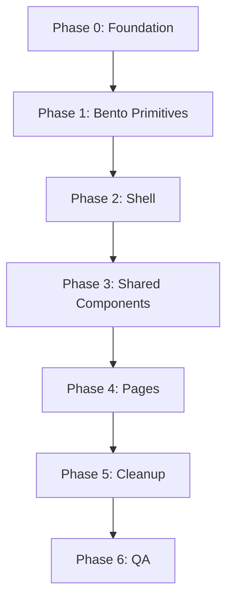

# ROHP Website Redesign — Implementation Plan

Migrate the entire site from the current v0/AI-scaffold aesthetic to **Campus Studio** — a bento-grid, big-screen, design-studio layout (see `STYLE.md`). Inspired by portfolio/agency sites like [WaxyWeb](https://waxyweb.com/), adapted for a UC Berkeley student program. Content stays the same; only the visual and interaction layers change.

**Estimated effort:** 4–6 days for one developer  
**Risk level:** Low–medium (new layout primitives, static site)  
**Branch strategy:** `redesign/campus-studio` off `main`

---

## Overview



| Phase | Focus | Duration | Pages affected |
|-------|-------|----------|----------------|
| 0 | Tokens, fonts (Outfit), utilities | 0.5 day | Global |
| 1 | BentoGrid, BentoTile, Marquee | 0.5–1 day | Reusable |
| 2 | Nav, footer, layout shell | 0.5 day | Global |
| 3 | Shared UI patterns | 0.5 day | Reusable |
| 4 | Page-by-page migration | 2 days | All 8 routes |
| 5 | Remove dead code, assets | 0.5 day | Global |
| 6 | QA, accessibility, responsive | 0.5 day | Global |

---

## Phase 0: Foundation (Tokens & Fonts)

**Goal:** Single source of truth for colors, typography, and bento utilities.

### 0.1 Update `app/globals.css`

- [ ] Remap `--primary` → `#003262` (Berkeley Blue)
- [ ] Remap `--accent` → `#FDB515`, `--accent-foreground` → `#003262`
- [ ] Set `--secondary` / `--muted` → `#F5F5F7` (studio surface)
- [ ] Set `--muted-foreground` → `#475569` (light mode)
- [ ] Add brand extension tokens:
  ```css
  --berkeley-blue-light: #1A4D7D;
  --berkeley-blue-muted: #E8EEF4;
  --california-gold-muted: #FEF3D6;
  --studio-surface: #F5F5F7;
  ```
- [ ] Update `@theme inline` font variables for **Outfit** + Source Sans 3
- [ ] Add `prefers-reduced-motion` block (see `STYLE.md` §8)
- [ ] Remove `scroll-behavior: smooth` from `html`
- [ ] Keep `.berkeley-blue` etc. temporarily (remove in Phase 5)

### 0.2 Update `app/layout.tsx`

- [ ] Remove Acme font and Source Serif 4 (if present)
- [ ] Add **Outfit** + Source Sans 3 via `next/font/google`
- [ ] Apply variables to `<body>`:
  ```tsx
  <body className={`${outfit.variable} ${sourceSans.variable} font-sans antialiased`}>
  ```

### 0.3 Update `components/ui/button.tsx`

- [ ] Ensure `default` variant uses `bg-primary text-primary-foreground`
- [ ] Add `outline` variant with `border-primary text-primary`
- [ ] Add inverse variant for CTAs on dark tiles: `bg-white text-primary`

### 0.4 Update shared layout components

- [ ] `components/section.tsx` — change `max-w-6xl` → `max-w-7xl`, add `wide` prop for `max-w-screen-2xl`
- [ ] `components/page-header.tsx` — refactor to bento layout (title tile + optional image tile)
- [ ] `components/stat-block.tsx` — Outfit display numbers, tile-ready

### 0.5 Verification

- [ ] `npm run build` passes
- [ ] Outfit loads on headings, Source Sans 3 on body

---

## Phase 1: Bento Primitives (New)

**Goal:** Reusable grid system before page migration.

### 1.1 Create `components/bento-grid.tsx`

```tsx
interface BentoGridProps {
  children: ReactNode
  className?: string
  wide?: boolean  // max-w-screen-2xl for homepage
}
```

- [ ] 12-column grid: `grid grid-cols-1 gap-4 md:gap-6 lg:grid-cols-12`
- [ ] Container: `max-w-7xl` default, `max-w-screen-2xl` when `wide`

### 1.2 Create `components/bento-tile.tsx`

```tsx
interface BentoTileProps {
  children: ReactNode
  span?: 3 | 4 | 6 | 8 | 12  // col-span mapping
  variant?: "default" | "primary" | "accent" | "ghost" | "image"
  href?: string
  className?: string
}
```

- [ ] Base: `rounded-2xl border border-border p-6`
- [ ] Variants per `STYLE.md` §5
- [ ] Interactive: `hover:scale-[1.02] hover:shadow-lg transition-all duration-300`
- [ ] `motion-reduce:hover:scale-100` for a11y
- [ ] `cursor-pointer` when `href` or `onClick` present

### 1.3 Create `components/marquee.tsx` (optional)

- [ ] Horizontal scroll strip for logos/images
- [ ] CSS animation, pause on hover
- [ ] Static fallback when `prefers-reduced-motion`

### 1.4 Verification

- [ ] Storybook or test page with sample bento layout (8+4, 4+4+4, 6+6)
- [ ] Tiles stack to single column at 375px

---

## Phase 2: Shell (Navigation, Footer, Layout)

**Goal:** Studio-style chrome on every page.

### 2.1 `components/navigation.tsx`

| Change | From | To |
|--------|------|----|
| Width | `max-w-6xl` | `max-w-7xl` |
| Style | flat border-b | optional floating `rounded-2xl` on md+ |
| Logo text | Source Serif | `font-heading font-bold` (Outfit) |
| Register button | legacy classes | `variant="default"` |

- [ ] Active route detection with `usePathname()`
- [ ] `aria-current="page"` on active link
- [ ] Account for nav height in page padding

### 2.2 `components/footer.tsx`

- [ ] `bg-primary text-primary-foreground`
- [ ] Bento-style column layout on desktop
- [ ] `max-w-7xl` container

### 2.3 `app/layout.tsx` structure

- [ ] Shell order: `Navigation` → `main` → `Footer`
- [ ] `min-h-screen flex flex-col` on body wrapper

### 2.4 Verification

- [ ] Navigate all routes — nav/footer consistent at 1440px and 375px

---

## Phase 3: Shared Component Patterns

**Goal:** Migrate card patterns to bento tiles.

### 3.1 Card → Bento tile migration

- [ ] Replace uniform `grid md:grid-cols-3` with `BentoGrid` + `BentoTile`
- [ ] `border-2` → `border border-border rounded-2xl`
- [ ] Gold circle icons → inline Lucide or colored tile variant
- [ ] `cursor-pointer` on clickable tiles

### 3.2 Remove animation demo components from imports

| Component | Action |
|-----------|--------|
| `split-text.tsx` | Remove import |
| `text-type.tsx` | Remove import |
| `pixel-transition.tsx` | Remove import |
| `magnetic-button.tsx` | Remove import |
| `fade-in.tsx` | Optional: stagger on bento grid only |

### 3.3 `components/registration-trigger.tsx`

- [ ] Standard `Button variant="default"` (no MagneticButton)

### 3.4 `components/committee-member-modal.tsx`

- [ ] `font-heading` (Outfit) for name
- [ ] Clean Dialog styling

---

## Phase 4: Page-by-Page Migration

Migrate in this order. Each page: bento layout → remove animation imports → verify responsive.

### 4.1 FAQ (`app/faq/page.tsx`)

- [ ] Bento header via `<PageHeader>`
- [ ] Search in `col-span-12` tile at top
- [ ] Accordion in wide tile

### 4.2 Housing (`app/housing/page.tsx`)

- [ ] Bento header
- [ ] Video grid: `6+6` embed tiles

### 4.3 Committee (`app/committee/page.tsx`)

- [ ] Bento header
- [ ] Photo grid: `4+4+4` image tiles with hover scale

### 4.4 Registration (`app/registration/page.tsx`)

- [ ] Bento header
- [ ] Download tiles `4+4+4`, form in `8+4` layout

### 4.5 Agenda hub (`app/agenda/page.tsx`)

- [ ] Bento header
- [ ] Virtual / Overnight: `6+6` comparison tiles with CTAs

### 4.6 Agenda Virtual & Overnight

- [ ] Bento header with breadcrumbs
- [ ] Timeline in `col-span-8`, sidebar `col-span-4`

### 4.7 Homepage (`app/page.tsx`) — most complex, do last

#### Hero
- [ ] `BentoGrid wide` with `8+4` or full-bleed image tile
- [ ] Oversized Outfit headline: `clamp(2.5rem, 8vw, 5rem)`
- [ ] Campus photo in image tile (or placeholder until asset ready)
- [ ] Primary CTA + secondary link

#### About
- [ ] `6+6` text + image tiles

#### Pillars
- [ ] `4+4+4` or asymmetric; one `variant="primary"` tile

#### Videos
- [ ] `6+6` embed tiles

#### Stats
- [ ] `3+3+3+3` or `4+4+4` stat tiles; one gold accent

#### Marquee (optional)
- [ ] Full-bleed partner/campus strip

#### CTA
- [ ] Centered or `8+4` CTA tile — not blue band

#### Contact
- [ ] `4+4+4` icon tiles

### 4.8 Per-page verification

- [ ] Bento grid on major sections
- [ ] `max-w-7xl` minimum
- [ ] No legacy animation imports
- [ ] No inline hex colors
- [ ] Responsive at 375px and 1536px
- [ ] Content unchanged

---

## Phase 5: Cleanup

### 5.1 Delete animation components

- [ ] `split-text.tsx`, `text-type.tsx`, `pixel-transition.tsx`, `magnetic-button.tsx`
- [ ] `fade-in.tsx` if fully replaced by bento stagger

### 5.2 Delete legacy CSS

- [ ] Remove `.berkeley-blue`, `.california-gold`, `.text-berkeley`, `.icon-berkeley`
- [ ] Delete `styles/globals.css` if duplicate

### 5.3 Image replacement (see `docs/IMAGE-REPLACEMENT.md`)

- [ ] Campus hero for bento image tile
- [ ] Committee photos optimized for square tiles
- [ ] Delete ChatGPT hero and stock placeholders

### 5.4 Dependency cleanup

- [ ] Remove `gsap` if unused
- [ ] Remove `motion` if unused
- [ ] Update `package.json` name

### 5.5 Build

- [ ] `npm run build` succeeds

---

## Phase 6: QA & Polish

### 6.1 Visual QA

Test at **375px**, **768px**, **1024px**, **1440px**, **1536px**

| Page | Desktop | Mobile | Bento stacks | Dark mode |
|------|---------|--------|--------------|-----------|
| `/` | ☐ | ☐ | ☐ | ☐ |
| `/agenda/` | ☐ | ☐ | ☐ | ☐ |
| `/agenda/virtual/` | ☐ | ☐ | ☐ | ☐ |
| `/agenda/overnight/` | ☐ | ☐ | ☐ | ☐ |
| `/faq/` | ☐ | ☐ | ☐ | ☐ |
| `/registration/` | ☐ | ☐ | ☐ | ☐ |
| `/housing/` | ☐ | ☐ | ☐ | ☐ |
| `/committee/` | ☐ | ☐ | ☐ | ☐ |

### 6.2 Accessibility

- [ ] Lighthouse accessibility ≥ 90
- [ ] Keyboard navigation on all tiles and buttons
- [ ] Marquee stops with `prefers-reduced-motion`
- [ ] Focus rings on interactive tiles
- [ ] Contrast ≥ 4.5:1

### 6.3 Performance

- [ ] Lighthouse performance ≥ 85
- [ ] Hero/tile images WebP, optimized
- [ ] No unused animation bundles

---

## File Change Matrix

| File | P0 | P1 | P2 | P3 | P4 | P5 |
|------|:--:|:--:|:--:|:--:|:--:|:--:|
| `app/globals.css` | ✓ | | | | | ✓ |
| `app/layout.tsx` | ✓ | | ✓ | | | |
| `components/bento-grid.tsx` | | ✓ | | | | |
| `components/bento-tile.tsx` | | ✓ | | | | |
| `components/marquee.tsx` | | ✓ | | | | |
| `components/navigation.tsx` | | | ✓ | | | |
| `components/footer.tsx` | | | ✓ | | | |
| `components/page-header.tsx` | ✓ | | | ✓ | | |
| `components/section.tsx` | ✓ | | | | | |
| `components/stat-block.tsx` | ✓ | | | ✓ | | |
| All `app/**/page.tsx` | | | | | ✓ | |
| Animation components | | | | | | ✓ delete |

---

## Definition of Done

1. All 8 routes use bento-grid layouts per `STYLE.md`
2. Outfit + Source Sans 3 throughout
3. `max-w-7xl` minimum; homepage uses wide bento
4. No legacy animation demo components
5. `npm run build` succeeds
6. Lighthouse: Accessibility ≥ 90, Performance ≥ 85
7. Visual review approved by ROHP stakeholder

---

## Suggested PR Strategy

| PR | Scope |
|----|-------|
| PR 1 | Phase 0 + 1 (tokens, Outfit, bento primitives) |
| PR 2 | Phase 2 + 3 (shell, shared patterns) |
| PR 3 | Phase 4 inner pages |
| PR 4 | Phase 4 homepage + Phase 5–6 cleanup |

Each PR: before/after screenshots at 375px and 1536px.
